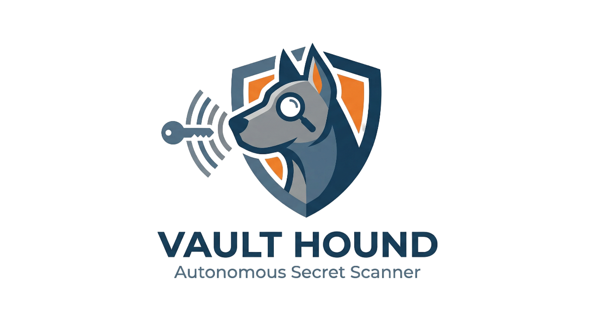

#  Vault Hound: Autonomous Account Watchman


**Vault Hound** is an autonomous DevSecOps and Secret Scanner system that monitors personal or corporate GitHub accounts in near real-time. Developed with a focus on high performance using Rust, it is built upon modern "Shift-Left" security principles.

##  Architecture: What is the "Watchman" Model?

Traditional security tools require integration into the CI/CD pipeline of every single project. The **Account Watchman Model** operates on a "Centralized SOC (Security Operations Center)" philosophy. 

Hosted in a single central repository via **GitHub Actions**, the Watchman agent uses the GitHub API to monitor **all repositories** associated with your account. 

When a code update (Push) is detected anywhere in your account:
1. It runs on an isolated GitHub Actions virtual machine.
2. It fetches the updated repository's source code directly into the runner's **RAM (Memory)** without writing to disk.
3. It performs rapid scanning using a dynamic library of 40+ enterprise-grade signatures (`rules.json`).
4. If a leak is detected, it autonomously opens a "Critical Security Alert (Issue)" **directly in the target repository**.

##  Key Features

- **Full Autonomy:** Patrols 24/7 via GitHub Actions Cron Jobs. Requires zero human intervention.
- **Dynamic Rule Engine:** Add new API signatures instantly via `rules.json` without recompiling the Rust binary.
- **Noise Reduction:** Automatically skips `.git`, `target`, compiled binaries, and media files to prevent False Positives.
- **Broad Signature Library:** Recognizes 40+ key formats including Cloud Providers (AWS, GCP), AI APIs (OpenAI, Anthropic), payment gateways (Stripe), and communication tools (Slack, Discord, Telegram).

##  Step-by-Step Setup & Integration

To deploy Vault Hound as an autonomous security shield, you need to generate a GitHub Token and grant it to this repository's GitHub Actions.

### Step 1: Create the GitHub Personal Access Token (PAT)
The system needs an authorization key to monitor your account and open Issues on your behalf.
1. Go to your GitHub profile and navigate to **Settings** > **Developer settings** > **Personal access tokens (classic)**.
2. Click **Generate new token (classic)**.
3. Name it `Vault Hound Watchman`.
4. Check **only** the **`repo`** scope (Full control of private repositories) and generate the token.
5. Copy the generated `ghp_...` key. Make sure to save it, as you won't see it again!

### Step 2: Add the Token to GitHub Actions Secrets
Now, we need to give this key to Vault Hound's Actions pipeline.
1. Go to the repository where you hosted Vault Hound (e.g., `Vault-Hound`).
2. Click on the **Settings** tab at the top.
3. From the left sidebar, navigate to **Secrets and variables** > **Actions**.
4. Click the green **New repository secret** button.
5. In the **Name** field, type exactly: `WATCHMAN_TOKEN`
6. In the **Secret** field, paste the `ghp_...` key you created in Step 1.
7. Click **Add secret**.

### Step 3: Awaken the System
Once the code and the secret are in place, the `.github/workflows/watchman.yml` file will automatically trigger. The system will start scanning your account every 5 minutes. You can also trigger it manually using the `Run workflow` button in the GitHub Actions tab.

##  Configuration (Adding Custom Rules)
If you want to add a new secret scanning rule, simply add a new JSON object to the `rules.json` file in the root directory:

```json
{
  "name": "Example Service API Key",
  "pattern": "service_prefix_[a-zA-Z0-9]{32}"
}
```
##  Security & Privacy
This tool is a preventative system designed to run entirely on GitHub's secure infrastructure. Source code fetched during the scan is **held entirely in the memory (RAM) of the ephemeral GitHub Actions runner**. It is never written to a hard drive or transferred to third-party servers. Once the GitHub Action job is completed, the runner and its memory are permanently destroyed.

---
*Developed with  Rust for modern DevSecOps standards.*